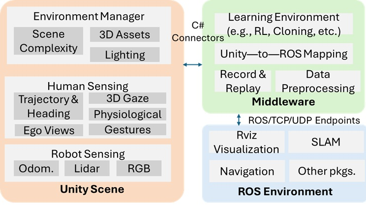

# **ConCord: Human-in-the-Loop, Cooperative Robot Exploration**

This is the code base for implementing ROS environment block of **ConCord: Human-in-the-Loop, Cooperative Robot Exploration**.



This simulation is intent to run along with Unity. First setup Unity Scene block mentioned in the diagram referring to the repository [Unity repository](https://github.com/Connected-and-Autonomous-Systems-Lab/Collaboration.git). If you want to run just a demonstration without simulating the robot in Unity, just refer "Run a complete demonstration saved in a ros bag".


## Requirements

1. ROS2 Humble [Get Started](https://docs.ros.org/en/humble/Installation.html)
2. ROS2 packages (install via `sudo apt install ...`):
   - ros-humble-nav2-bringup
   - ros-humble-slam-toolbox
   - ros-humble-turtlebot3-cartographer
   - ros-humble-ros-tcp-endpoint
   - ros-humble-rviz2
   - ros-humble-tf2-ros

## Run a complete demonstration saved in a ros bag

The following code brings up an instance from the dataset and how Concord worked on a simulated robot in Unity along with that human.

```bash
ros2 launch collaborate demonstration.launch.py
```

## Run a robot asynchronously with a user run

The following will run an instance from the dataset along with a robot in Unity. Refer the following link for the dataset. [Dataset Documentation](readme_files/dataset_README.md)

```bash
ros2 launch human_robot_pkg human_in_the_loop.launch.py
```

Make sure you disable the human player in the Unity scene as you are just using the previous run of the human run.

```bash
ros2 launch human_robot_pkg navigation_highlevel.launch.py
```

Finally,

```bash
ros2 run human_robot_pkg frontier_navigator
```

You will see the robot from Unity will start to complement the human player and search for human victims.


## Known errors

### 1. Lookup error
The following error in Rviz
```bash
symbol lookup error: /snap/core20/current/lib/x86_64-linux-gnu/libpthread.so.0: undefined symbol: __libc_pthread_init, version GLIBC_PRIVATE
```

Solution:
```bash
unset GTK_PATH
```

### 2. C extension not present

```bash
ModuleNotFoundError: No module named 'rclpy._rclpy_pybind11'
The C extension '/opt/ros/humble/lib/python3.10/site-packages/_rclpy_pybind11.cpython-38-x86_64-linux-gnu.so' isn't present on the system. Please refer to 'https://docs.ros.org/en/humble/Guides/Installation-Troubleshooting.html#import-failing-without-library-present-on-the-system' for possible solutions
```

Solution:
Deactivate the conda environments(deactivate even base) to go to the python version you initially installed ROS2 on. Run the python file then
