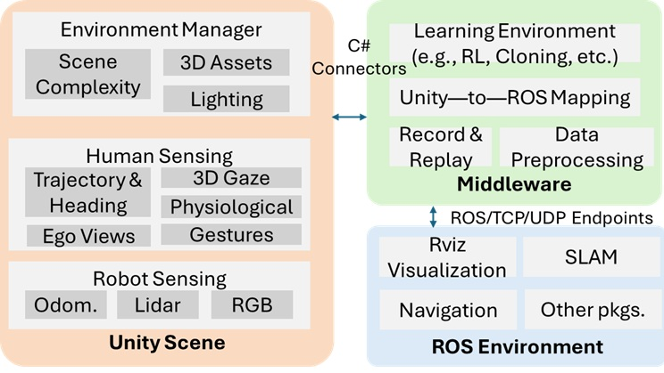

# **ConCord: Human-in-the-Loop, Cooperative Robot Exploration**

This is the code base for implementing ROS environment block of **ConCord: Human-in-the-Loop, Cooperative Robot Exploration**.



This simulation is intent to run along with Unity. First setup Unity Scene block mentioned in the diagram referring to the repository [Unity repository](https://github.com/Connected-and-Autonomous-Systems-Lab/Collaboration.git). If you want to run just a demonstration without simulating the robot in Unity, just refer "Run a complete demonstration saved in a ros bag".


## Requirements

1. ROS2 Humble [Get Started](https://docs.ros.org/en/humble/Installation.html)
2. ROS2 packages (install via `sudo apt install ...`):
   - ros-humble-nav2-bringup
   - ros-humble-slam-toolbox
   - ros-humble-turtlebot3-cartographer
   - ros-humble-ros-tcp-endpoint
   - ros-humble-rviz2
   - ros-humble-tf2-ros

## Run a complete demonstration saved in a ros bag (under development)

The following code brings up an instance from the dataset and how Concord worked on a simulated robot in Unity along with that human.

```bash
ros2 launch collaborate demonstration.launch.py
```

## Run a robot asynchronously with a user run

The following will run an instance from the dataset along with a robot in Unity. A sample run of the dataset is included in the dataset folder [sample run](sample_run/rosbag2_2025_12_04-17_01_38_0.db3). Change the path of the folder if necessary in line 202 of [launch file](unity_end/human_robot_pkg/launch/ConCord.launch.py). Refer the following link for the [Dataset Documentation](dataset_README.md)

1. Start the Unity and play HardScene.scene. [Unity repository](https://github.com/Connected-and-Autonomous-Systems-Lab/Collaboration.git)
2. Build the ros workspace using:

```bash
colcon build --symlink-install
```

3. Open three terminals and run the following.

```bash
cd $(ros_workspace)
source install/setup.bash
```

quick commands

```bash
conda deactivate
cd ~/Documents/iros
source install/setup.bash
```

4. Terminal 1: Run the launch file to start uncoordinated explo-
ration.

```bash
ros2 launch human_robot_pkg ConCord.launch.py
```

5. Terminal 2: Run nav2 launch file.

```bash
ros2 launch human_robot_pkg navigation_highlevel.launch.py
```

6. Terminal 3: Run the uncoordinated exploration.

```bash
ros2 run human_robot_pkg frontier_navigator
```

7. Visualize the RViz2 window while the robot runs in Unity. The log file for the result comparison will be saved. We suggest running both experiments for 10 minutes.


## Known errors

### 1. Lookup error
The following error in Rviz
```bash
symbol lookup error: /snap/core20/current/lib/x86_64-linux-gnu/libpthread.so.0: undefined symbol: __libc_pthread_init, version GLIBC_PRIVATE
```

Solution:
```bash
unset GTK_PATH
```

### 2. C extension not present

```bash
ModuleNotFoundError: No module named 'rclpy._rclpy_pybind11'
The C extension '/opt/ros/humble/lib/python3.10/site-packages/_rclpy_pybind11.cpython-38-x86_64-linux-gnu.so' isn't present on the system. Please refer to 'https://docs.ros.org/en/humble/Guides/Installation-Troubleshooting.html#import-failing-without-library-present-on-the-system' for possible solutions
```

Solution:
Deactivate the conda environments(deactivate even base) to go to the python version you initially installed ROS2 on. Run the python file then


### 3. Transform data too old in Controller server

```bash
[controller_server-1] [ERROR] [1775093646.921101943] [tf_help]: Transform data too old when converting from merged_map to odom
[controller_server-1] [ERROR] [1775093646.921150245] [tf_help]: Data time: 1775093630s 747304384ns, Transform time: 65s 606661987ns
[controller_server-1] [ERROR] [1775093646.967835670] [controller_server]: Failed to make progress
[controller_server-1] [WARN] [1775093646.967952823] [controller_server]: [follow_path] [ActionServer] Aborting handle.
[bt_navigator-5] [WARN] [1775093646.996778421] [bt_navigator]: [navigate_to_pose] [ActionServer] Aborting handle.
[bt_navigator-5] [ERROR] [1775093646.996926037] [bt_navigator]: Goal failed
```

Some node is publishing old time. Most probably system time instead of ROS sim time.